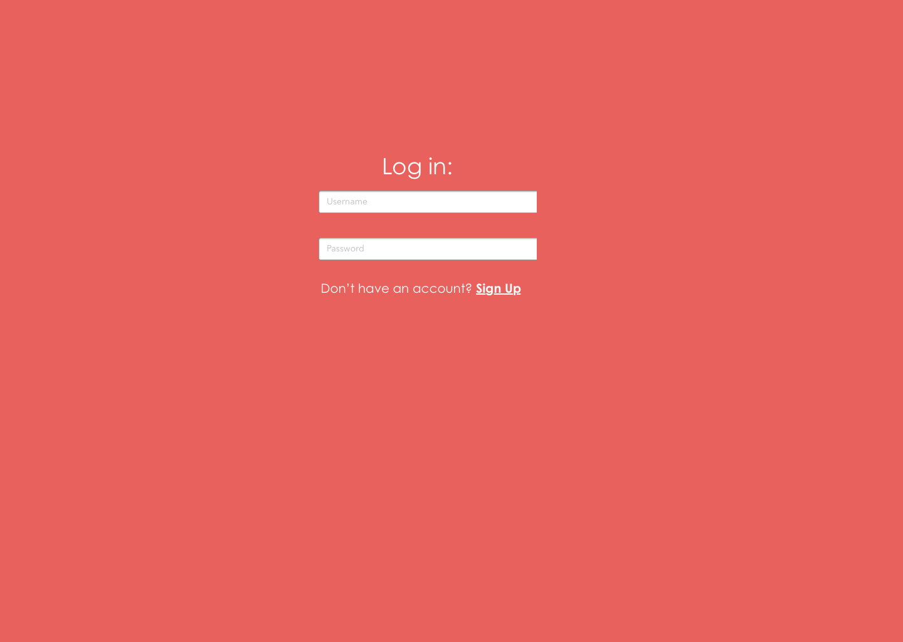

# gosafely-webapp

## Overview

For my 3rd project, and first full-stack web app, I created a web app for a local tech safety company, GoSafely. The user interacts with the app by entering their information into the input field and submitting it, thus saving their information to the database.

## Live Site

[Click here](gosafely-webapp.herokuapp.com)

## Technologies Used

* **Stack** - Mongo (Mongoose), Express (Body-Parser), React (Axios, React-Router-Dom, Styled-Components), Node.js (Nodemon, Concurrently)

* **Languages Used** - HTML5, CSS3, JavaScript

## Wireframe

## ERD

## Trello Board

[Click here to view the Trello board](https://trello.com/b/lc08Yxve/gosafely-web-app)

## Future Development

* Complete login feature
* Enable user to edit their information
* Integrate Google Maps API and Twilio API
* Add Emergency contacts to user profile
* Add Device registration  